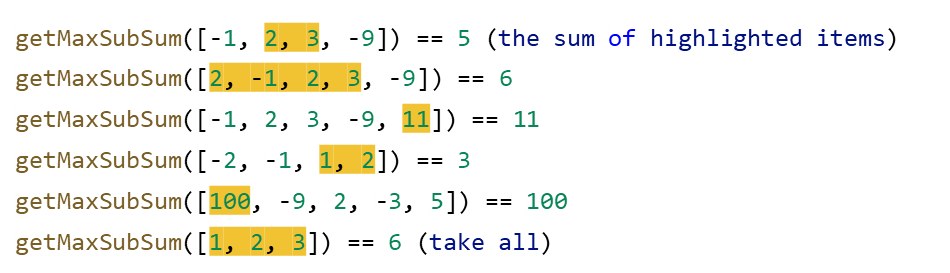

## CodeCamp #15

### นาย ประกาศิต กางถิ่น

---

#### โจทย์การบ้านที่ทำ

- Maximal contiguous subarray (**Optional**)
  ให้เขียนฟังก์ชัน getMaxSubSum(arr) ที่ return ผลรวมของ subarray ที่มากที่สุดที่ติดกัน
  
