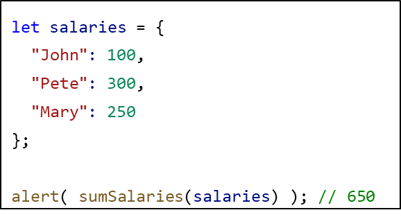

## CodeCamp #15

### นาย ประกาศิต กางถิ่น

---

#### โจทย์การบ้านที่ทำ

- กำหนดให้ salaries เป็น Object
  ให้เขียนฟังก์ชัน sumSalaries(salaries) ที่คืนค่าเป็นผลผมรวมของเงินเดือน ถ้า salaries ไม่มีสมาชิก ให้คืนค่าเป็น 0

