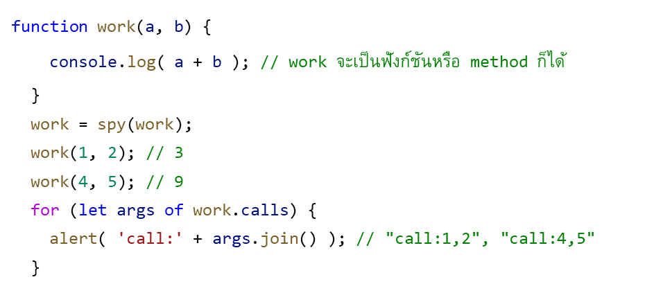

## CodeCamp #15

### นาย ประกาศิต กางถิ่น

---

#### โจทย์การบ้านที่ทำ

- Lab ให้สร้าง decorator ฟังก์ชัน ชื่อ spy(func) โดยทำให้ work ที่รับ argument เข้าไป return ค่า ออกมาเป็น “call : argument1, agrument2”

