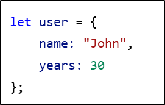

## CodeCamp #15

### นาย ประกาศิต กางถิ่น

---

#### โจทย์การบ้านที่ทำ

ถ้าเรามี Object

- ให้เขียน Destrcutring assignment ที่ให้

1. property ที่ชื่อ name ไปอยู่ในตัวแปร name
2. property ที่ชื่อ years ไปอยู่ในตัวแปร age
3. property ที่ชื่อ isAdmin ไปอยู่ในตัวแปร isAdmin (ให้เป็น false ถ้าไม่มีค่าให้กำหนด)
