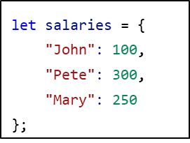

## CodeCamp #15

### นาย ประกาศิต กางถิ่น

---

#### โจทย์การบ้านที่ทำ

ถ้าเรามี Object ชื่อ salaries

- ให้สร้าง function topSalary(salaries) ที่คืนค่าชื่อคนที่มีเงินเดือนสูงสุด

1. ถ้า salaries ไม่มีข้อมูลให้คืนค่าเป็น null
2. ถ้าสูงสุดมีหลายคน ก็ให้คืนใครก็ได้สักคน
