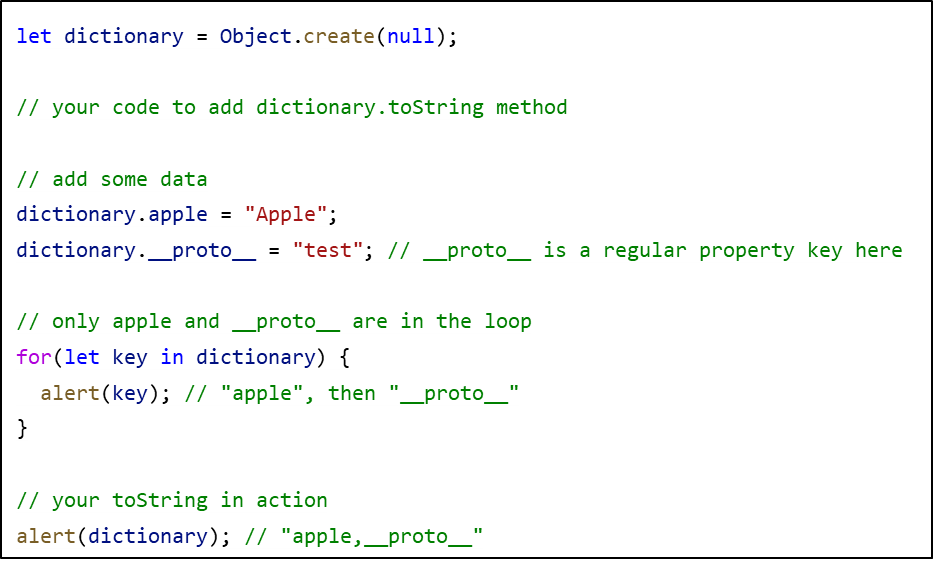

## CodeCamp #15

### นาย ประกาศิต กางถิ่น

---

#### โจทย์การบ้านที่ทำ

- มี Object Dictionary ที่สร้างจาก Object.create(null) เพื่อเก็บ key/value pairs
  - ให้เพิ่ม Method dictionary.toString() และคืนค่าเป็น key ทั้งหมดออกมาที่คั้นด้วย comma
    
